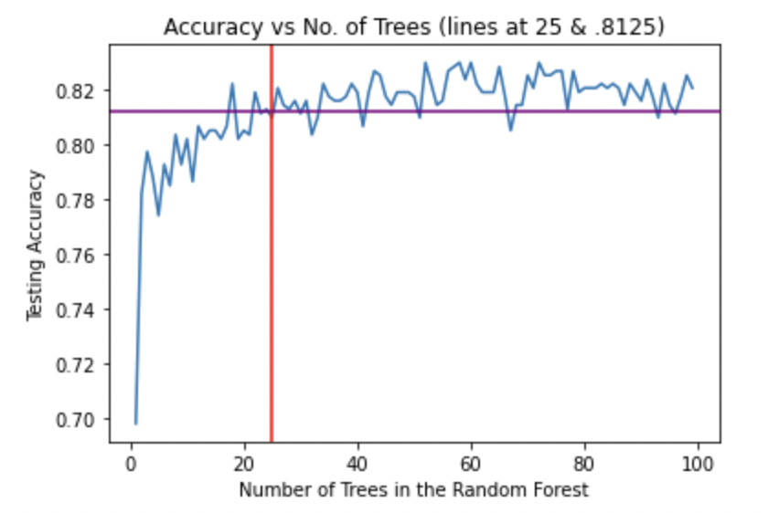
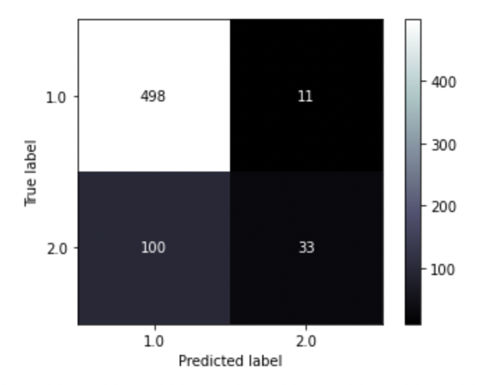
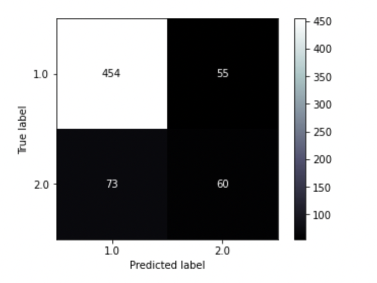

# Phase 3 Project: Finding Religion
**Author**: [Ferdinand Beaman](mailto:ferdinand.beaman@gmail.com)

## Overview

I wanted to see if you could predict if someone believes in a god just based on their other, seemingly unrelated opinions. 
All data was drawn from the 2017 World Values Survey (https://www.worldvaluessurvey.org/WVSDocumentationWV7.jsp).
No distinction was made between different theist beliefs, so the only focus was on the difference between theists and atheists in a general sense.

The expectation is that the machine learning algorithms are specialized and powerful enough to perform a classification task such as this one. If properly calibrated, the methods used are likely able to pick up on underlying patterns within the answers to these questions and adequately sort the respondants into their proper categories.

## Business Problem

Experience shows that many religious groups tend to vote in blocks. Additionally, people ensconced in media bubbles (religious or secular) are likely to find certain products/videos/etc more engaging. It is not hard to imagine that one group responds very differently to, say, sexually suggestive media or messaging that promotes "traditional" values. Being able to target one group versus the other is efficient and will save money for any business looking to capitalize on these trends.

## Data

Over 2,500 Americans were surveyed, and over 250 questions were asked of each of them. The questions ranged from simple demographic identifications to opinions on drug use and domestic abuse. Every state was represented, and the median age of the respondents was somewhere between 45 and 54. 

Theists and atheists made up about 79% and 21% of the relevant population, respectively.

## Methods

This project made heavy use of ensemble methods, namely GradientBoostedClassifier trees and RandomForests. Grid Search Cross Validation was also used extensively, which I must say is thus far the most useful time-saving device I have learned here at Flatiron. 

Two logistic regressions were also performed, but they both oddly became stuck merely always guessing that every person was religious. Thankfully, the decision trees made some headway.

Importantly, any questions that seemed to too obviously relate to a theist belief (e.g. "Do you believe in Hell?") or anything that would reasonably/obviously be swayed by someone's demographics were omitted. 

Early on in this process, one cell took over a half an hour to process. It was determined that one of the culprits behind this long runtime was the arbitrarily chosen hyperparameter which controlled the number of decision trees that were generated. Graphs such as this one below likely saved a lot of time. This one in particular showed that the proper number of decision trees seems to reach an asymptote around 20, literally a tenth of what was initially chosen for the aforementioned cell.

## Evaluation of Results

None of my models were able to be more than 83% accurate, meaning it was exceptionally difficult to do much better than a "dumb" model guessing "theist" every time and being correct 79% of the time. Recall for atheists was especially troublesome, as even approaching 50% in that regard seemed miraculous. The final model ended up being a RandomForest with an accuracy just barely over 80%, which I chose over the slightly more accurate GradientBoostedClassifier because the recall and f1 scores for the minority class (harmonic mean of recall and precision) were superior.

I did not use AUC/ROC as I found the confusion matrices and classification reports to be much clearer and concrete for me to understand.

This is the confusion matrix for the best GradientBoostedClassifier that I had, which ended up being my choice for second best. Notice the terrible recall forthe minority class. 
(1.0 = theists, 2.0 = atheists)

And below is the confusion matrix for what ended up being my final model. It has over 50% precision for the minority class and nearly 50% recall, despite an overall low accuracy score.

## Conclusions

It was very difficult to cleanly separate atheists from the pack. Many theists were easily catagorized, leading to a very high precision score for them in many models, but there appears to be a muddled, almost featureless mass of people that refuse to be stereotyped. This goes for both the religious and areligious alike. There's something nice to say about that.

In any case, my hypothetical client could use my model to at least *somewhat* efficiently track down believers or nonbelievers, doing with that information whatever they wish.

### Next Steps

Additional insight could be found by incorporating demographics data. I removed it mostly just because I was personally curious to see if it was still possible to make this work without it. But religiosity does vary predictably by gender, race, socioeconomic status, and age. If you wanted to make much more accurate predictions, leave those columns in.

Lastly, it would be insightful to not only see what questions are predictive, but gather information on which answers to those questions pointed in one direction or the other. That, sadly, was outside the scope of my project for today.
